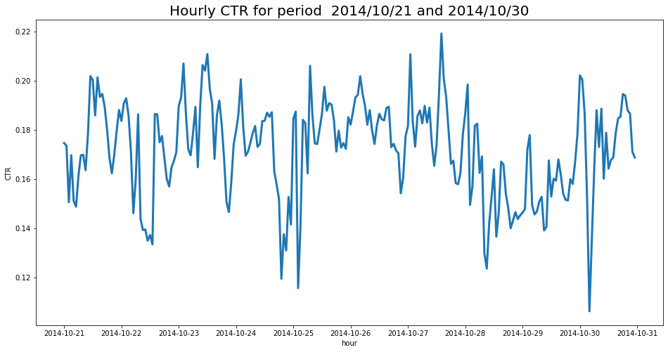
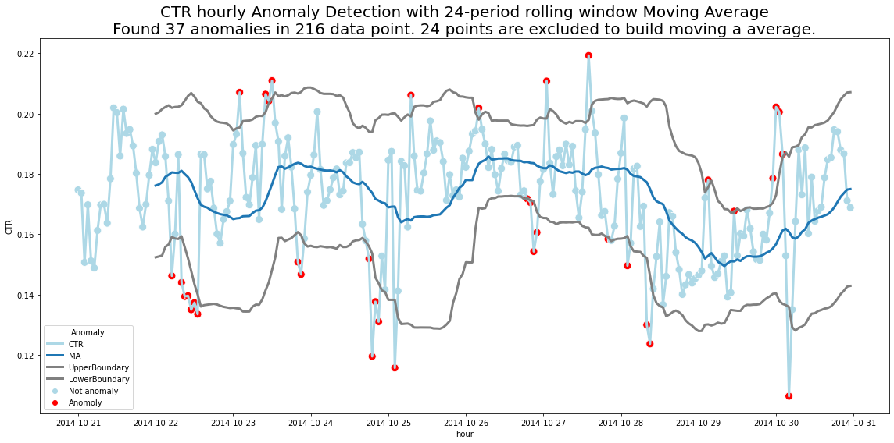

CTR Anomaly Detection
====
 

Introduction
============

> Click-through rate (CTR) is the ratio of users who click on a specific link to the number of total users who view a page, email, or advertisement. It is commonly used to measure the success of an online advertising campaign for a particular website as well as the effectiveness of email campaigns
> - [Wikipedia](https://en.wikipedia.org/wiki/Click-through_rate)

The main goal of the repository is an introduction to a simple approach in CTR Anomaly Detection.

Depending on available data, there are a lot of approaches for anomaly detection. If **data is labeled** (each point in time has a label anomaly / not anomaly, then supervised learning approaches can be used. Thus, it is a classification task where logistic regression, random forest, SVM, boosting, RNN, etc. can be applied. Here you have to pay attention to:
* Data imbalance because usually there are just a few anomalies (less than 5% of all available data) and 
* [Cross validation through time](https://scikit-learn.org/stable/modules/generated/sklearn.model_selection.TimeSeriesSplit.html).

In case **labels are not provided**, other unsupervised techniques should be applied. There are also several methods for anomaly detection, but the general approach is quite similar: predict a value and compare it with a realized value. And if the residual is more or less than some threshold, then it is an anomaly.

There are several methods to make a prediction: moving average (simple, weighted) taking into account the last few hours or days or weekdays, etc., ARIMA model, Prophet, [seasonal Hybrid Extreme Studentized Deviate](https://arxiv.org/pdf/1704.07706.pdf) technique and many others.

CTR time series

Requirements
============
* Python 3+
* pandas 1.2.1+
* numpy 1.19.2+
* seaborn 0.11.1+
* matplotlib 3.3.2+
* scipy 1.3.1+

Structure
============
There are two Notebooks:
* In the [Exploratory Data Analysis notebook](./exploratory_data_analysis.ipynb) are given data description, variables preparation, and CTR calculation and visualization.
* In the [Time series anomaly detection notebook](./anomaly_detection.ipynb), we are going to use a moving average for prediction and 1.5 standard deviations as a threshold.

Data
============
The underlying data is derived from a former Kaggle competition, that was about predicting “Click-Through-Rates” (CTR).
CTR is defined as clicks divided by impressions and it measures how often advertisements are clicked relative to how often they are shown.
The data is available in [Kaggle competition](https://www.kaggle.com/c/avazu-ctr-prediction)

CTR over time
============
The data set includes a lot of dimensional fields with (categorical) information about the environment (device, location, etc) but we are only concentrating on CTR and time series relevant fields, such as
* click: 0/1 for non-click/click
* hour: format is YYMMDDHH, so 14091123 means 23:00 on Sept. 11, 2014 UTC.

Results
============

The simple Moving Approach works quite well for anomaly detection.
By varying the MA period in the `plot_anmolies()` function, you can try to find the optimal period value. But given the nature of the data, I recommend using a period as a multiple of 24. If you would like to find less and more robust anomalies, use period 48, 72, or more.

